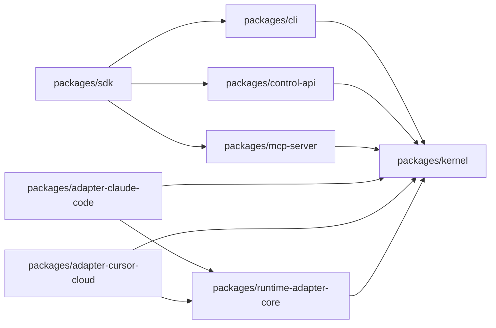

# Package Boundaries

WorkGraph is a coordination control plane. Package boundaries should optimize for
clear ownership, low duplication, and agent-readable architecture.

## Layering

## Ownership

- `packages/kernel`
  Owns the domain model and workspace state machine: primitives, registry, store,
  ledger, threads, missions, dispatch orchestration, triggers, graph, auth,
  policy integration, and control-plane semantics. Lease reconciliation,
  autonomy recovery loops, trigger evaluation, and trigger safety enforcement
  belong here because they are domain-governed orchestration behavior.

- `packages/runtime-adapter-core`
  Owns reusable dispatch adapter contracts plus generic transports that do not
  need direct ownership of WorkGraph domain behavior. Today that means
  `shell-subprocess`, `webhook`, and the shared adapter interface types.
  Adapter execution lifecycle hooks such as cancellation/abort propagation and
  heartbeat callbacks should be defined here, not invented ad hoc inside
  individual adapters.

- `packages/adapter-claude-code`
  Owns Claude Code-specific command templating and execution behavior. It should
  depend on `runtime-adapter-core` for adapter contracts and generic shell
  transport, not on kernel-owned adapter contracts.

- `packages/adapter-cursor-cloud`
  Owns Cursor Cloud-style execution behavior. It depends on kernel for thread and
  workspace domain operations, and on `runtime-adapter-core` for adapter
  contracts.

- `packages/mcp-server`
  Owns the MCP transport and tool surface over kernel capabilities. It should not
  duplicate domain logic or carry unused package dependencies. Trigger CRUD/fire
  MCP tools should compose kernel-owned trigger behavior rather than implement
  a parallel trigger engine.

- `packages/control-api`
  Owns HTTP composition: REST, SSE, webhook gateway, and HTTP MCP hosting.

- `packages/sdk`
  Owns the curated public package surface. It should expose stable, intentional
  namespaces rather than mirror every internal workspace package blindly.

## Non-boundaries

- `packages/policy`
  This is not currently a clean standalone ownership boundary. The real policy
  behavior still depends on kernel-integrated auth, ledger, and mutation flows.
  Until policy is fully extracted, it should not be treated as a primary public
  API boundary.

## Boundary rules

- Do not add new generic dispatch contracts to kernel if they belong in
  `runtime-adapter-core`.
- Do not expose a workspace package through `sdk` unless it is an intentional
  public surface.
- Do not create parallel implementations of the same domain behavior across
  packages.
- If a package cannot own its behavior cleanly, collapse the false boundary
  instead of preserving it as a facade.
